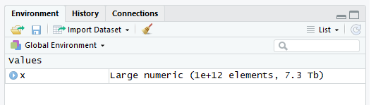

class: center

```{r setup, include=FALSE}
options(htmltools.dir.version = FALSE)
library(knitr)
knitr::opts_chunk$set(collapse = FALSE)
```

Fortement inspiré de **The R Inferno** par Patrick Burns


eBook gratuit : [https://www.burns-stat.com/documents/books/the-r-inferno/](www.burns-stat.com/documents/books/the-r-inferno/)

---
class: inverse, center, middle

# = vs <-

---

# Pleins d'espaces 
.pull-left[
```{r, eval=FALSE}
x<-1
x< -1
x=1
x=-1
```
]
--
.pull-right[
```{r, eval=FALSE}
x <- 1
x < -1
x = 1
x = -1
```
]

---

# "<-" != "="
```{r, error=TRUE, collapse=TRUE}
data.frame(
    a1 <- 1:3
)

a1

data.frame(
    a2 = 1:3
)

a2
```

---

# "<-" != "="
```{r, error=TRUE, collapse=TRUE}
system.time(
    x <- 1:5
)

x

system.time(
    y = 1:5
)

y

```

---
class: inverse, center, middle

#Comparaisons

---

```{r}
x <- 1:5
x
```
```{r, eval=FALSE}
x == 2|3
```
--
```{r, echo=FALSE}
x == 2|3
```
--
```{r, eval=FALSE}
x == (2|3)
```
--
```{r, echo=FALSE}
x == (2|3)
```
--
```{r}
x == 2 | x == 3

x %in% c(2, 3)
```

---

```{r}
x
```
```{r, error=TRUE}
1 < x < 4
```
```{r}
1 < x & x < 4
```

---

```{r}
0.1/1
```
--
```{r, eval = FALSE}
0.1/1 == 0.1
```
--
```{r, echo = FALSE}
0.1/1 == 0.1
```
--
Tout va vien.
--
```{r, eval = FALSE}
0.3/3
```
--
```{r, echo = FALSE}
0.3/3
```
--
```{r, eval = FALSE}
0.3/3 == 0.1
```
--
```{r, echo = FALSE}
0.3/3 == 0.1
```
(－‸ლ)

---

# Résumons :

```{r}
mon_vecteur <- c(0.1/1, 0.2/2, 0.3/3, 0.4/4, 0.5/5, 0.6/6, 0.7/7, 0.8/8)
mon_vecteur
```
--
```{r}
mon_vecteur == 0.1
```
--
5/8, pas terrible. :-/

---

# Les floats sonts des approximations

```{r, collapse=TRUE}
print(0.1  , digits = 18)

print(0.3/3, digits = 18)
```
--
```{r, collapse=TRUE}
pryr::bytes(0.1  )

pryr::bytes(0.3/3)

pryr::bits( 0.1  )

pryr::bits( 0.3/3)
```

---

# Une solution ?
```{r, collapse = TRUE}
epsilon <- 10^-10

mon_vecteur

mon_vecteur == 0.1

abs(mon_vecteur - 0.1) < epsilon

```

---
# Redéfinissons '=='

```{r, collapse = TRUE}
0.3/3 == 0.1

`==` <- function(x, y, epsilon = 10^-10) {
    abs(x - y) < epsilon
}

0.3/3 == 0.1
```
--
```{r, error = TRUE, collapse = TRUE}
"a" == "a"
```
--
Pas bien !
```{r, collapse = TRUE}
rm(`==`)
"a" == "a"
```

---

# Une meilleure solution :
```{r, collapse = TRUE}

`%~=%` <- function(x, y, epsilon = 10^-10) {
    abs(x - y) < epsilon
}

0.3/3 == 0.1

0.3/3 %~=% 0.1
```
--
```{r, collapse = TRUE}
(0.3/3) %~=% 0.1

```

---

# Un problème assez fréquent

```{r}
my_seq <- seq(0, 0.4, len = 5)
my_seq

my_seq[4]

my_seq[4] == 0.3
```

---

# Quizz : NA, NaN, NULL
.pull-left[
```{r, eval=FALSE}
3L == NA

3L == NaN

3L == NULL
```
]
--
.pull-right[
```{r, echo=FALSE, collapse=FALSE}
3L == NA

3L == NaN

3L == NULL
```
]

---

# Quizz : NA, NaN, NULL
.pull-left[
```{r, eval=FALSE}
NA == NA

NaN == NaN

NULL == NULL
```
]
--
.pull-right[
```{r, echo=FALSE, collapse=FALSE}
NA == NA

NaN == NaN

NULL == NULL
```
]

---

# Quizz : NA, NaN, NULL
.pull-left[
```{r, eval=FALSE}
NA == NaN

NA == NULL

NaN == NULL
```
]
--
.pull-right[
```{r, echo=FALSE, collapse=FALSE}
NA == NaN

NA == NULL

NaN == NULL
```
]

--

Utilisez `is.na()`, `is.nan()` et `is.null()` pour tester contre `NA`, `NaN` et `NULL`.
```{r}
is.null(logical(0))
```

---

# Inf == Inf
.pull-left[
```{r, eval=FALSE}
1/0

1/-0

0/0

exp(Inf)

exp(Inf) == log(Inf)
```
]
--
.pull-right[
```{r, echo=FALSE}
1/0

1/-0

0/0

exp(Inf)

exp(Inf) == log(Inf)
```
]

--

L'aide de R :

*NaN means ‘Not a Number’*
--
```{r, collapse=TRUE}
is.numeric(NaN)
```

---
class: inverse, middle, center

# Une dispute sur les arguments

---

```{r, eval = FALSE}
min(4, 5, 1, 2, 3)
```
--
```{r, echo = FALSE}
min(4, 5, 1, 2, 3)
```
--
```{r, eval = FALSE}
max(4, 5, 1, 2, 3)
```
--
```{r, echo = FALSE}
max(4, 5, 1, 2, 3)
```
--
Tout va bien.
--
```{r, eval = FALSE}
mean(4, 5, 1, 2, 3)
```
--
```{r, echo = FALSE}
mean(4, 5, 1, 2, 3)
```
--
Pas d'erreure, pas de *warnings*, un résultat de type attendu.
(－‸ლ)
--
```{r}
median(4, 5, 1, 2, 3)
```

---

# Pas vraiement un problème en pratique :

```{r}
x <- c(4, 5, 1, 2, 3)
min(x)

max(x)

mean(x)

median(x)
```

---

# "L'échantillonage aléatoire" aléatoire

```{r}
x <- c(3.14, 1.41, 42)

sample(x, size = 7, replace = TRUE)
```
--
```{r, eval=FALSE}
x <- c(3.14)

sample(x, size = 7, replace = TRUE)

```
--
```{r, echo=FALSE}
x <- c(3.14)

sample(x, size = 7, replace = TRUE)

```
--
Vérifier la taille de `x` avant de le passer a `sample()`

---
class: inverse, center, middle

# Les facteurs accidentels
## stringsAsFactors = FALSE

---

```{r, collapse=TRUE, warning=TRUE}
x <- factor(c(105:100, 105, 104))
x
x >= 103
```
--
```{r, collapse=TRUE}
as.numeric(x) >= 103
```


---

```{r, collapse=TRUE, warning=TRUE}
x <- factor(c(105:100, 105, 104))
x
x >= 103
```
```{r, collapse=TRUE}
as.numeric(x) >= 103
```
```{r, collapse=TRUE}
as.numeric(x)

as.numeric(as.character(x))

as.numeric(as.character(x)) >= 103

as.numeric(levels(x))[x]

```

---

# fusions de factors

```{r}
x <- factor(c(5, 6))
x

y <- factor(c(10, 11))
y
```

```{r, eval=FALSE}
c(x, y)
```
--
```{r, echo=FALSE}
c(x, y)
```

---

# fusions de factors

```{r, collapse=TRUE}
x

y

factor(c(as.numeric(as.character(x)), as.numeric(as.character(y))))

unlist(list(x, y))
```

---

# Factors, encore :
```{r, collapse=TRUE}
df <- data.frame(a = 2:3, b = c("x", "y"))
df

df[1, ]

as.character(df[1, ])

```


---

# Factors, encore :
```{r, collapse=TRUE}

df[1, , drop = TRUE]

df <- data.frame(a = 2:3, b = c("x", "y"), stringsAsFactors = FALSE)
df[1, ]

```

---
class: inverse, center, middle

# Extractions

---

```{r, collapse=TRUE}
tb1 <- data.frame(x1 = 1:5)
tb1

tb2 <- tb1[c(2, 4, 5), ]
```
--
```{r, collapse=TRUE}
tb2
```
--
```{r, collapse=TRUE}
tb2 <- tb1[c(2, 4, 5), , drop = FALSE]
tb2

```

---

# Une petite énigme

```{r, echo=FALSE}
i <- 3 - 10^-15

```

```{r}
i

x <- 1:5
x
```

```{r, eval = FALSE}
x[i]
```
--
```{r, echo = FALSE}
x[i]
```
--
```{r}
as.integer(i)
```
--
```{r}
i <- 3 - 10^-15
```

---

```{r, collapse=TRUE}
myMat <- matrix(1:6, ncol = 2)
myMat

```

.pull-left[
```{r, collapse=TRUE}
df1 <- data.frame(X = 101:103,
                  Y = myMat)
df1
```
]
.pull-right[
```{r, collapse=TRUE}
df2 <- data.frame(X = 101:103)
df2$Y <- myMat
df2
```
]

---

```{r, collapse=TRUE}
myMat <- matrix(1:6, ncol = 2)
myMat

```

.pull-left[
```{r, collapse=TRUE}
df1 <- data.frame(X = 101:103,
                  Y = myMat)
df1
dim(df1)
df1$Y
df1$Y.1
```
]
.pull-right[
```{r, collapse=TRUE}
df2 <- data.frame(X = 101:103)
df2$Y <- myMat
df2
dim(df2)
df2$Y
df2$Y.1
```
]

---
class: inverse, center, middle

# Error: cannot allocate vector of size...
## Nouvelle édition

---

```{r, collapse=TRUE, error=TRUE}
x <- 1:(10^12)
head(x)

tail(x)

x[1]

x[5]

x[12345]
```
--
```{r, collapse=TRUE, error=TRUE}
x[5] <- 2

x[5] <- 2L

x
```

---


--

# La magie d'ALTREP

```{r, error=TRUE}
x[2] <- 1

sum(x)
```

---

# ALTREP

Plus d'infos : 
+ [ftp://stat.ethz.ch/Teaching/maechler/R/eRum_2018_ProgR-ALTREP.html#20](ftp://stat.ethz.ch/Teaching/maechler/R/eRum_2018_ProgR-ALTREP.html#20)

+ [http://homepage.stat.uiowa.edu/~luke/talks/nzsa-2017.pdf](http://homepage.stat.uiowa.edu/~luke/talks/nzsa-2017.pdf)

+ [https://svn.r-project.org/R/branches/ALTREP/ALTREP.html](https://svn.r-project.org/R/branches/ALTREP/ALTREP.html)

---

# Pour aller plus loin

+ The R inferno (Patrick Burns) : [www.burns-stat.com/documents/books/the-r-inferno/](https://www.burns-stat.com/documents/books/the-r-inferno/)

+ C'est l'enfeR : [bioinfo-fr.net/cest-lenfer](https://bioinfo-fr.net/cest-lenfer)

+ Petite collection d'exemples : [github.com/EdinbR/edinbr-talks/blob/master/2015-11-18/Rinferno.R](https://github.com/EdinbR/edinbr-talks/blob/master/2015-11-18/Rinferno.R)

---

# Bonus

```{r, collapse=TRUE}
T

T <- FALSE

T
```

```{r, collapse=TRUE}
c(5, 10, 12)

c <- function(...) list(...)

c(5, 10, 12)
```

---

# Bonus

```{r, collapse=TRUE}
plus_deux <- function(x) {
    return(x + 2)
}

plus_deux(5)

return <- function(x) x + 10

plus_deux(5)
```

```{r}
rm(T, c, return)
```

---

# Bonus

```{r}

mon_test <- c(TRUE, FALSE, FALSE)

if(mon_test) {
    message("Succés !")
} else {
    message("Echec !")
}
    
```
